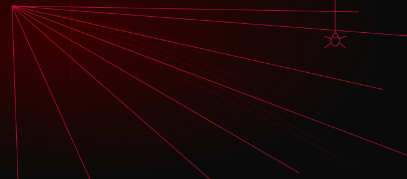

  

<h2 align="center">🕸️ SPIDER-SENSE ACTIVATED 🕸️</h2>

<table> <tr> <td width="65%" valign="middle">

🕷️ ABOUT ME

I'm Abhishek Kumar, a Full Stack Web Developer who enjoys turning complex problems into clean, scalable and user-friendly applications.

🔭 Assistant Software Developer at Lovely Professional University
🕷️ Building Student & Staff UMS modules
⚡ Working mainly with Next.js, TypeScript & Material UI
📧 Built a full-stack Email Distribution System
📚 Creator of Novel Web, a MERN-stack reading & publishing platform
🎓 B.Tech in Computer Science & Engineering
🌱 Constantly learning and exploring new technologies
🕸️ I enjoy working across both frontend and backend

"With great code comes great responsibility."

</td>

<td width="35%" align="center">

</td> </tr> </table>

---

<h2 align="center">🕷️ WEB-SHOOTERS (Tech Stack) 🕷️</h2>

<!-- 

 -->
**Languages**
 

**Frontend**
 

**Backend & Database**
 

**Tools**
 

---

<h2 align="center">🏙️ MISSIONS COMPLETED (Projects) 🏙️</h2>

<table align="center" width="90%">
  <tr>
    <td width="50%" valign="top">
      <h3>🕸️ Email Distribution System</h3>
      
<b>Tech:</b> Next.js, Node.js, SQL Server, SMTP, IMAP, TypeScript

      
Full-stack email distribution platform for internal communication — SMTP/IMAP integration, backend APIs with Stored Procedures, email assignment & tracking, role-based workflows. Later migrated to .NET architecture.

    </td>
    <td width="50%" valign="top">
      <h3>🕷️ Novel Web</h3>
      
<b>Tech:</b> React.js, Node.js, Express.js, MongoDB, JWT, REST API

      
Full-stack novel reading & publishing platform (MERN). JWT auth, protected routes, chapter-wise reading/writing, admin dashboard for books/categories/users.

      
    </td>
  </tr>
</table>

---

<table>
<tr>
<td width="70%">

## 💼 EXPERIENCE 💼

**🕷️ Assistant Software Developer (Full-Time)** — *Lovely Professional University*, Jalandhar
`July 2025 – Present`
- Developing & maintaining Student/Staff UMS modules using Next.js, TypeScript, Material UI
- Built reusable, responsive frontend components
- Worked with SQL Server & Stored Procedures for backend data operations
- Independently built a full-stack Email Distribution System (Node.js, SQL Server, SMTP/IMAP)
- Collaborated on migrating the Email system from Node.js to .NET

**🕸️ Full Stack Web Developer (Intern)** — *Ansh Infotech*, Ludhiana
`Jan 2025 – Jun 2025`
- Built interactive dashboards & data management modules using the MERN stack
- Integrated JWT-based authentication and Role-Based Access Control (RBAC)
- Developed responsive frontend components with React.js & Bootstrap

</td>
<td width="30%">

</td>
</tr>
</table>
<!-- <h2 align="center">🎓 EDUCATION 🎓</h2>

**B.Tech, Computer Science and Engineering** — Ramgarhia Institute of Engineering and Technology (IKGPTU), Phagwara
`2021 – 2025` · CGPA: 7.35/10 -->

---

<h2 align="center">📊 SPIDER-SENSE STATS 📊</h2>

---

<h3 align="center" style="margin:10px 0;">
  🕸️ "It's not who I am underneath, but what I code that defines me." 🕸️
</h3>

